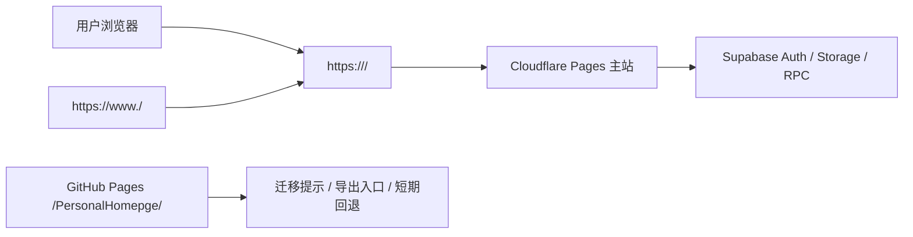

# 主域名迁移方案与回滚预案

## Summary

本文档对应 Phase 1.14.0，用于在真正修改 DNS、Supabase Auth 和生产部署链路前，先固定主域名迁移的执行方案、检查清单和回滚路径。

本阶段只生成方案，不执行线上切流，不修改 Supabase 配置，不新增 migration，也不改变当前 GitHub Pages 发布流程。

## 核心决策

- 正式主站迁移到 Cloudflare Pages。
- canonical host 推荐使用 apex domain，例如 `https://<primary-domain>/`。
- `https://www.<primary-domain>/` 作为别名，统一 301/308 跳转到 apex domain。
- 当前 GitHub Pages 地址保留为 legacy 入口和短期回退入口，不再作为长期主站。
- 新主站使用根路径 `/`，旧 GitHub Pages 继续使用 `/PersonalHomepge/` 项目路径。
- 数据保全优先级高于切流速度。迁移期间必须明确说明 localStorage 受 origin 隔离影响，旧站纯本地数据不会自动出现在新域名。

## 目标架构

| 模块 | 迁移后角色 | 说明 |
|---|---|---|
| Cloudflare DNS | 主域名 DNS | 托管 apex 和 `www`，启用代理和基础安全能力 |
| Cloudflare Pages | 主站生产部署 | 连接 GitHub 仓库，生产分支使用 `production`，输出目录 `out` |
| GitHub Pages | legacy / fallback | 保留旧路径提示、数据导出入口和短期回退能力 |
| Supabase Auth | 登录和账号恢复 | `Site URL` 切换到正式主域名，迁移窗口保留旧站和 localhost redirect |
| Supabase Storage | Banner/背景图片 | 继续由 Supabase 提供资源访问，新域名只影响前端来源和回归验证 |
| Supabase Postgres/RPC | 同步、历史和观测 | 不因域名迁移改变 RLS/RPC 数据模型 |

推荐流量关系：

## CI/CD 策略

目标是尽量保持低成本、少分叉、可回滚。

- Cloudflare Pages 生产分支使用 `production`。
- Cloudflare Pages 构建命令建议为 `npm run typecheck && npm run lint && npm run build && npm run verify:export`。
- 输出目录使用 `out`。
- Node 版本和当前 GitHub Actions 保持一致。
- GitHub Actions 暂时继续保留 GitHub Pages 发布能力，用作 legacy 入口和回滚路径。
- 代码仍保持同一套 Next.js static export，不引入服务端 runtime。
- Phase 1.14.1 后应通过环境变量区分根路径构建和 legacy 项目路径构建：
  - 主域名：`NEXT_PUBLIC_BASE_PATH` 为空或未设置。
  - GitHub Pages legacy：`NEXT_PUBLIC_BASE_PATH=/PersonalHomepge`。
- `NEXT_PUBLIC_BASE_PATH` 会被规范化：空值或 `/` 表示根路径；非空值必须以 `/` 开头；尾部斜杠会被去除；重复斜杠会阻止构建。
- `npm run verify:export` 用于检查 `out/` 中的 `_next` 资源前缀，避免根路径和 legacy 项目路径混用。

## 用户数据迁移策略

localStorage 按 origin 隔离。主域名迁移后，旧 GitHub Pages 上的本地首页、同步码绑定、本地快照和 UI 偏好不会自动出现在新域名。

| 用户类型 | 迁移策略 | 风险控制 |
|---|---|---|
| 已登录账号托管用户 | 在新主站登录账号，恢复账号托管首页空间 | 切流前回归 Magic Link、账号托管空间恢复、云端历史和 Storage 图片 |
| 普通同步码用户 | 在新主站输入完整同步码重新绑定 | 切流前回归同步码绑定、拉取、冲突处理和暂停状态 |
| 纯本地用户 | 旧站导出数据包，新站导入数据包 | 旧站保留导出入口和清晰提示，避免误以为数据丢失 |
| 多浏览器用户 | 每个浏览器各自处理本地数据迁移 | 文案明确“浏览器本地数据不会跨域自动迁移” |

迁移提示必须覆盖：

- 已登录用户：新主站登录即可恢复账号托管空间。
- 同步码用户：保留完整同步码即可在新主站恢复。
- 纯本地用户：先在旧站导出，再到新站导入。
- 不要清空旧站浏览器数据，直到确认新主站数据正常。

## Pre-cutover Checklist

正式切流前必须完成：

- Phase 1.14.1：根路径构建通过，本地和 preview 下 `_next`、图片、路由均不带错误前缀。
- Phase 1.14.2：Supabase Auth `Site URL`、`Redirect URLs` 和 Storage 回归方案已准备。
- Phase 1.14.3：Cloudflare Pages preview 部署可访问。
- Phase 1.14.4：Cloudflare 安全基线配置方案已确认。
- Phase 1.14.5：GitHub Pages legacy 迁移提示和导出路径已准备。
- `npm run typecheck`、`npm run lint`、`npm run build` 均通过。
- 旧站导出、新站导入手动流程已验证。
- 账号托管恢复、普通同步码绑定、数据恢复中心、Banner/背景图片均在 preview 验证。
- 产品埋点和错误监控能区分新旧 host。

## Supabase/Auth Checklist

执行 Supabase 配置变更前记录当前值，便于回滚。

- 记录当前 `Site URL`。
- 记录当前全部 `Redirect URLs`。
- 新增正式主域名 redirect。
- 迁移窗口保留 localhost redirect。
- 迁移窗口保留旧 GitHub Pages redirect。
- Magic Link 登录后应回到当前发起登录的 host。
- 验证账号托管空间恢复不会跳回旧站。
- 验证登出、重新登录和 session 刷新。
- 确认 Supabase anon key 仍只作为前端公开 key 使用，service role 不进入前端、GitHub Pages、Cloudflare Pages 环境变量或构建产物。

## Cloudflare Pages Checklist

- 创建 Cloudflare Pages project。
- 连接 GitHub 仓库。
- Production branch 设置为 `production`。
- Build command 设置为 `npm run typecheck && npm run lint && npm run build && npm run verify:export`。
- Output directory 设置为 `out`。
- Node 版本与当前 GitHub Actions 对齐。
- 配置 `NEXT_PUBLIC_SUPABASE_URL`、`NEXT_PUBLIC_SUPABASE_ANON_KEY` 等公开前端变量。
- 主域名构建不设置 GitHub Pages legacy base path。
- 主域名 preview 构建后执行 `npm run verify:export`，确认 `_next` 资源以 `/_next/` 开头。
- Preview deployment 完整回归后再绑定 production custom domain。

## 安全基线 Checklist

Cloudflare：

- DNS 记录启用代理。
- SSL/TLS 使用 `Full (strict)`。
- 开启 Always Use HTTPS。
- 开启 DNSSEC。
- 保持 Cloudflare 默认 DDoS 防护。
- 开启可用的 Free Managed Ruleset。
- HSTS 先使用短周期或暂缓，稳定后再拉长 max-age。
- CSP 先采用保守策略或 report-only，避免一次性破坏 Supabase/Auth/Storage 流程。

账号与仓库：

- Cloudflare、GitHub、Supabase 管理账号启用 2FA。
- 优先使用硬件密钥。
- repository secrets、Actions variables、Cloudflare Pages variables 分别检查。
- 不发布 sourcemap。
- 不提交 `.env`。
- 不把 service role、管理员密钥、第三方 API key 写入前端。

## Cutover Steps

1. 确认 GitHub `production` 分支代码已冻结或仅允许迁移修复。
2. 执行根路径构建并完成 Cloudflare Pages preview 回归。
3. 更新 Supabase Auth `Site URL` 和 `Redirect URLs`，保留旧站 redirect。
4. 在 Cloudflare Pages 绑定正式主域名。
5. 配置 apex 和 `www` DNS。
6. 设置 `www` 到 apex 的 redirect。
7. 验证 HTTPS 证书、首页加载、静态资源、Magic Link、账号恢复和同步。
8. 发布或开启 GitHub Pages legacy 迁移提示。
9. 观察产品埋点、错误监控、Cloudflare 请求状态和用户反馈。

## Post-cutover Observation

切流后至少观察 24 小时，建议 72 小时后再决定是否关闭旧站完整应用。

重点观察：

- 首页加载成功率。
- `_next` 资源 404。
- Magic Link 登录成功率。
- 账号托管空间恢复成功率。
- 同步码绑定和冲突处理。
- Storage Banner/背景图片显示。
- 数据恢复中心本地/云端历史可用性。
- `client_error_events` 新增错误类型。
- Cloudflare 4xx/5xx、WAF 命中和异常流量。
- 旧站导出、新站导入相关用户反馈。

## Rollback Plan

### Cloudflare Pages 部署回滚

适用：新版本前端有 bug，但 DNS、Auth 配置仍可用。

1. 在 Cloudflare Pages 回滚到上一成功 deployment。
2. 验证首页加载、登录、同步和 Storage 图片。
3. 保留 Supabase Auth 新主域名配置。
4. 记录错误监控和回滚时间点。

### DNS 回退

适用：Cloudflare Pages 或主域名访问异常，无法通过 deployment rollback 解决。

1. 将 apex / `www` DNS 指向已验证可用的备用目标。
2. 如需临时回到 GitHub Pages，确认旧站仍能完整运行或至少提供导出入口。
3. 等待 DNS 缓存刷新期间，在旧站和公告位置提示当前状态。
4. 回滚后复测 Magic Link redirect，避免登录回调落到不可用 host。

### Supabase Auth 回滚

适用：Magic Link 或账号恢复跳转异常。

1. 恢复切流前记录的 `Site URL`。
2. 保留新主域名 redirect 一段时间，避免已发出的 Magic Link 失效。
3. 复测旧站和新站登录。
4. 记录异常 redirect URL 和浏览器来源。

### GitHub Pages fallback

适用：主站需要暂停，但必须保护用户数据迁移能力。

1. GitHub Pages legacy 地址保持可访问。
2. 至少保留数据导出入口和新状态说明。
3. 明确提醒纯本地用户不要清空浏览器数据。
4. 如果旧站完整应用仍可运行，可短期允许用户继续使用并导出。

### 用户数据支持路径

适用：用户反馈“新站数据为空”。

排查顺序：

1. 确认用户是否换了域名和浏览器。
2. 如果是账号托管用户，引导登录账号并恢复当前首页空间。
3. 如果是同步码用户，引导输入完整同步码绑定。
4. 如果是纯本地用户，引导回旧站导出数据包，再到新站导入。
5. 如果旧站也看不到数据，检查浏览器 localStorage、数据恢复中心和导出备份。

## Go / No-go Criteria

Go 条件：

- 根路径构建、Cloudflare Pages preview 和 GitHub Pages legacy 构建均通过。
- Supabase Auth 登录、账号托管恢复和同步码绑定均通过。
- Storage 图片、数据恢复中心、埋点和错误监控均通过。
- 旧站导出、新站导入流程可用。
- 回滚路径已演练或至少完成手动步骤确认。

No-go 条件：

- 根路径静态资源存在系统性 404。
- Magic Link 登录无法稳定回到新主站。
- 账号托管恢复或同步码拉取存在数据覆盖风险。
- 旧站无法提供导出入口。
- Cloudflare Pages preview 未完成 P0 数据保全回归。

## Phase Handoff

- Phase 1.14.1：实现根路径构建与 legacy base path 双目标配置。
- Phase 1.14.2：执行 Supabase Auth、Storage 和回调 URL 迁移准备。
- Phase 1.14.3：建立 Cloudflare Pages 主站部署。
- Phase 1.14.4：落地 Cloudflare 安全基线。
- Phase 1.14.5：实现 GitHub Pages 旧站迁移提示。
- Phase 1.14.6：评估闭源开发和仓库安全收口。
- Phase 1.14.7：正式切流、回归和回滚演练。
